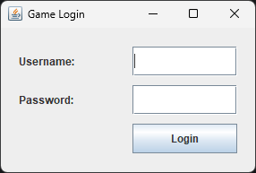
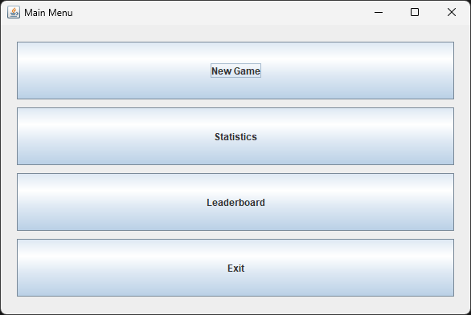
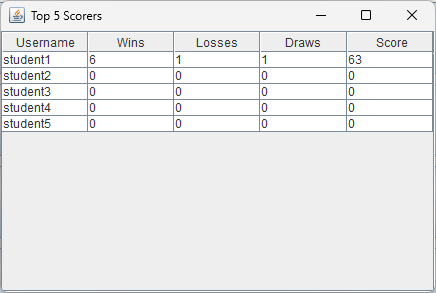
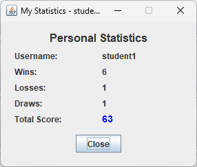
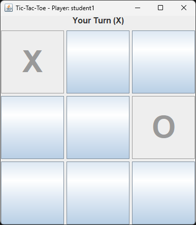

# Simple Tic-Tac-Toe Game with Java Swing, Login, and Statistics

## Student Information
Name: Ellvis Cornelius Setiawan <br>
Student ID: 5026251060 <br>
Class: E

## Project Description
This project is a simple Tic-Tac-Toe game built using Java Swing.
The application includes login, game statistics, and Top 5 scorer
feature.

## Features
- Login using database
- Play Tic-Tac-Toe using Swing GUI
- Record wins, losses, draws, and score
- Display personal statistics
- Display Top 5 scorers using JTable

## Database
Database used: <b>MySQL</b>

## How to Run
1. Clone the project using ```git clone https://github.com/ellviscs/student-swing-game-project.git```
2. Create the database using MySQL or MariaDB
3. Open the project folder.
4. In there you'll find database folder. Import the ```schema.sql``` into your database.
5. Next find src folder in base folder and find DatabaseManager.java.
6. Configure DatabaseManager.java with your database settings.
7. Add JDBC driver.
8. Run Main.java file.

## Class Explanation
### Main:
This class is used to run the entire game. 
### DatabaseManager: 
This class is used to maintain the connection to MySql/MariaDB. 
Make sure to change 'URL', 'USER', and 'PASSWORD' before start the game.
### Player: 
This class is used to make Player object in this program.
This helps program to store the Player data into the game.
### PlayerService:
This class is used to maintain Player login and update statistics and refresh statistics. 
This class most likely used to take Player data from database.
### GameLogic:
This class handle all the logic needed in Tic-Tac-Toe game.
This class is used to validate the move and check game status like Win, draw, or false.
### LoginFrame:
This class is used to make a login UI for player before they enter the game.
### MainMenuFrame:
This class is used to make a main menu UI.
### GameFrame:
This class is used to make a Tic-Tac-Toe UI. This class also help to maintain the game flow.
### StatisticsFrame:
This class is used to make a UI for statistics. When clicked, it's open the windows about player statistics like 
Win, Lose, draw, and total score.
### TopScorersFrame:
This class is used to display top scorer from all player registered in database.

## Screenshots






## Video Link
YouTube: <iframe width="560" height="315" src="https://www.youtube.com/embed/YkQwEDFqlSk?si=S_5MEVoV2kc1eX24" title="YouTube video player" frameborder="0" allow="accelerometer; autoplay; clipboard-write; encrypted-media; gyroscope; picture-in-picture; web-share" referrerpolicy="strict-origin-when-cross-origin" allowfullscreen></iframe>
